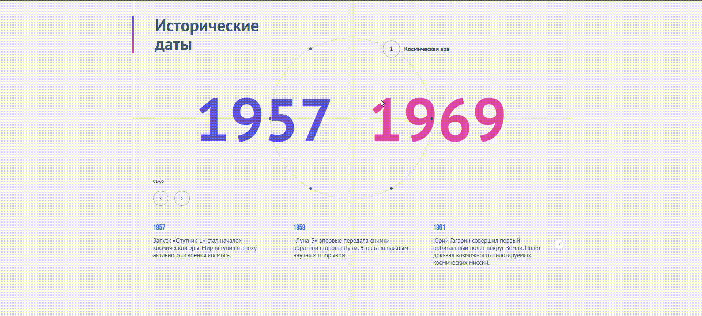
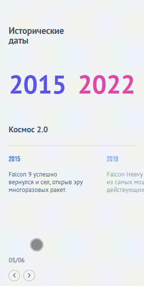

# Historical Dates UI

Интерактивный таймлайн с анимацией элементов по окружности

---

## 🚀 Overview

UI-компонент для отображения исторических периодов и событий
в виде круга с точками, синхронизированного со списком событий.

Реализована анимация поворота по кратчайшему пути и согласованная работа
между визуальным представлением и состоянием приложения.

---

## 🌐 Live Demo

https://historical-dates-widget.vercel.app

---

## ✨ Features

- Размещение элементов по окружности (динамический расчёт углов)
- Поворот круга по **кратчайшему пути**
- Синхронизация активной точки и списка событий
- Анимации через GSAP
- Адаптивная верстка
- Чистая компонентная архитектура (разделение Circle / EventsSlider)

---

## 📱 Responsive





---

## ⚙️ Tech Stack

- React
- TypeScript
- GSAP
- SCSS (modules)
- Vite

---

## 🧠 Key Implementation Details

- Расчёт позиций элементов через:
  - `step = 360 / N`
  - смещение активного элемента

- Нормализация углов и выбор кратчайшего пути вращения
- Разделение логики:
  - Circle (геометрия и вращение)
  - EventsSlider (контент и навигация)

- Управление анимациями через GSAP с контролем гонок (killTweens)

---

## ▶️ Run locally

```bash
npm install
npm run dev
```

---

## 📦 Build

```bash
npm run build
npm run preview
```

---

## 📌 Notes

Проект реализован как тестовое задание с фокусом на:

- анимации и UX
- точность вычислений
- синхронизацию состояния и UI

---
